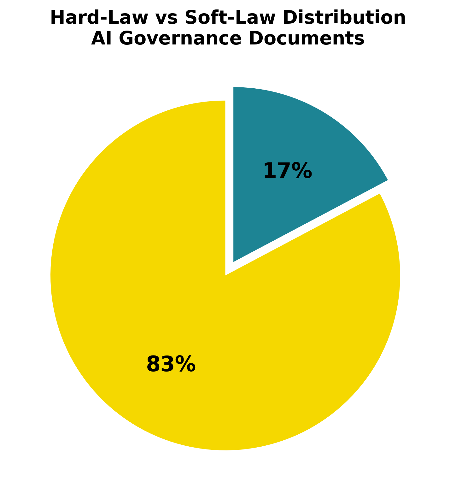
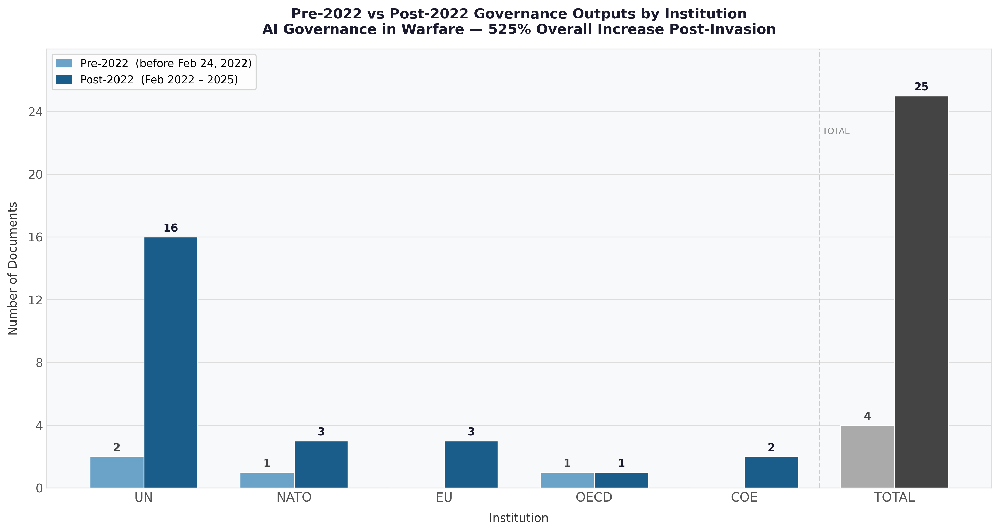

 

# Abstract
Artificial Intelligence (AI) has rapidly integrated into our world of conflict by reshaping how warfare works, targeting systems, and the deployment of military technology. The 2022 Russia-Ukraine war highlighted significant challenges regarding both weapons systems and the legal and governance frameworks governing AI use, raising concerns about accountability, the rules of war, and the adequacy of current international regulatory frameworks. Despite the growing usage of AI in military contexts, there remains limited empirical analysis of whether international institutions have meaningfully adapted their governance responses considering this conflict. This study will look towards the Ukraine-Russia war as a critical juncture in the global governance of military AI. Drawing on theories such as global governance and historical institutionalism, this research analyzes how international institutions respond to major security shocks and technological disruptions, especially regarding the distinction between hard-law and soft-law regulatory approaches. The study will use a qualitative research design based on document and thematic analysis of official government documents, reports, and statements issued by international institutions between 2015-2025. It will test the hypothesis that intergovernmental organizations produce a greater number of AI governance outputs in the two years after the invasion started. By examining the content of these outputs, this research assesses whether institutional responses represent incremental adaptation or more substantial governance change. The findings aim to contribute to broader debates on AI governance, global security, and institutional change in the context of modern warfare.

# Introduction

Artificial Intelligence (AI) has become one of the most fast-advancing technologies of the 21st century. It has reshaped industries, governance systems and most significantly the norms of armed conflict. Autonomous targeting systems, battlefield intelligence platforms, drones, cyber operations have one element that has improved significantly because AI has increasingly become standard features of modern warfare. 

The ongoing conflict Russia-Ukraine war with the Russian invasion of February 24, 2022 has placed these developments at the forefront of international political debate. The conflict has been described as the first large-scale conflict in which AI-enabled technologies play a very key role in military operations, raising urgent questions about accountability, protection of civilians, and the adequacy of current international regulatory frameworks (@RakhmetovMurzagulova2025;@kostenko2022).

However, as the war progresses the global governance of military AI remains fragmented and largely non-binding. This governance gap poses serious risks to international peace and security (@tallberg2023;@sweijs2024). This study asks a direct empirical question: Has the Russia-Ukraine war constituted a critical juncture in the global governance of Military AI? Drawing on Historical Institutionalism (HI) and Global Governance Theory, this research examines the connection of how international institutions have responded to the invasion, tests whether a measurable surge in governance outputs occurred, and analyzes whether the outputs represent substantive transformative change or if it is only an incremental adaptation within existing legal frameworks.

This study will make three specific contributions to the literature. First, it provides empirical evidence through a dataset of 29 official IGO documents spanning 2015-2025 on whether and how institutional responses to the invasion changed. Second, it applies Historical Institutionalism critical juncture framework to the domain of military AI governance, which remains very underexplored in the existing scholarship. Lastly, it uses the 1997 Ottawa Treaty on the prohibition of landmines as a governance benchmark, offering a historically grounded standard against which current responses can be assessed.

The paper proceeds as follows. Section 2 reviews the relevant literature on AI governance, Historical Institutionalism and the Ottawa Treaty analogy. Section 3 outlines the methodology. Section 4 presents the empirical findings, supported by charts and figures. Section 5 provides a discussion and analysis of those findings.

# Literature Review

Artificial Intelligence (AI) has become one of the defining technological developments of the twenty-first century, rapidly advancing across commercial, social, and military domains. In recent years, AI has transformed military operations by enabling autonomous targeting, battlefield analytics, intelligence collection, and high-precision strikes—capabilities that significantly alter how states plan, conduct, and respond to conflict. The Russia–Ukraine war, beginning in 2022, intensified global attention on the military applications of AI, demonstrating not only the strategic advantages these systems provide but also the legal, ethical, and humanitarian challenges surrounding their use in warfare. Scholars increasingly note that the conflict has accelerated debates about whether AI technologies represent a critical point in the evolution of global military governance and safety (@hendrycks2025; @onderco2025).

International institutions—including the United Nations (UN), NATO, the European Union (EU), Council of Europe and the OECD—now face growing pressure to regulate AI in ways that balance innovation, security imperatives, and the protection of civilians. Yet existing regulatory frameworks, particularly International Humanitarian Law (IHL), have been strained by the demands and implications of emerging AI systems. This has raised important questions about whether these institutions have taken meaningful steps to modernize legal norms and governance mechanisms to keep pace with technological change (@herreraPerez2024; @kostenko2022).

This literature review therefore examines two interconnected areas of scholarship central to this research. First, it reviews theoretical perspectives—especially Historical Institutionalism—that help explain how institutions respond to technological disruption and geopolitical shocks. Second, it analyzes empirical research on AI governance, institutional responses, and the regulatory challenges associated with AI-enabled warfare. Together, these bodies of literature provide the foundation for assessing whether international institutions have adapted their approaches to governing military AI, particularly in the wake of the Russia–Ukraine conflict and the broader debates it has catalyzed.

## Historical Institutionalism: Theoretical Foundations

The foundation of this research is rooted in institutionalism, particularly in understanding how international institutions govern AI within conflict settings. This requires examining the broader processes through which institutions develop rules and norms to regulate state behavior. Within institutionalism, this study adopts the specific stream of Historical Institutionalism (HI), which provides a framework for understanding how governance structures emerge, evolve, and follow long-term institutional trajectories.

One of the central research questions asks whether the Ukraine–Russia war represents a critical juncture in the rapid development of military AI governance. HI identifies critical junctures as periods of heightened uncertainty during which institutional change becomes possible because major events undermine existing legal and institutional paradigms (@capoccia2007). Crises such as wars, geopolitical conflicts, or technological breakthroughs often expose weaknesses in current regulatory frameworks, weakening path-dependent constraints and creating opportunities to revise policies to align with modern norms (@mahoney2010).

This research design can offer an understanding of whether international organizations such as the UN, NATO and the EU have developed well-supported AI governance structures in response to the Russia-Ukraine war. Historical Institutionalism assists in distinguishing between incremental institutional evolution and greater significant transformative changes that can indicate a true critical juncture. This distinction supports the hypothesis outlined in the research proposal and guides the assessment of how policy shifts reflect continuity or meaningful institutional adaptation.

Building from @capoccia2007, @soifer2012 refines the logic of critical juncture by separating it into two sections: permissive conditions, which open a window for change, and productive conditions, which determine what kind of change actually occurs. Applied to this study, the Russia-Ukraine 2022 war constitutes the permissive condition, loosening path-dependent constraints on IGO governance. Whether productive conditions exist, such as political will for binding law, determines whether the juncture produces transformative or merely incremental changes (@soifer2012).

This distinction is important because path-dependent institutions tend to resist transformation even under crisis pressure, adapting their existing frameworks rather than creating new binding mechanisms (@mahoney2010). This theoretical perspective directly supports the research design by offering a lens through which to analyze whether international organizations such as NATO, the UN, and the EU have modified their AI governance structures in response to the Ukraine–Russia war. HI also helps distinguish between incremental institutional evolution and the more significant, transformative change that would indicate the presence of a true critical juncture. This analytical distinction aligns with the hypotheses outlined in the research proposal and guides the assessment of whether observed policy shifts reflect continuity or meaningful institutional adaptation.

## Ottawa Treaty

This historical treaty shows how global governance systems respond to threats like the Ottawa Treaty, which prohibited anti-personnel landmines. This treaty emerged from humanitarian crisis and advocacy that helped expose the lack of regulatory frameworks. 

From a historical institutionalist perspective, it was due to crisis and humanitarian concerns that led to institutional innovation. The collective agreement between states and international institutions to construct new governance principles when existing norms fail to address technological or military challenges. This treaty is valuable for understanding whether current developments surrounding military AI—particularly following the Russia-Ukraine war—reflect similar dynamics of crisis-driven institutional adaptation or instead represent change within existing governance structures. 

A central analytical distinction in this research is understanding the difference between hard and soft law regulatory approaches. Hard law refers to binding instruments that impose enforceable obligations on states (@sweijs2024). Soft law consists of non-binding guidelines, principles and resolutions that carry normative weight without legal precedents. In the context of Military AI governance, this distinction matters because binding frameworks require political consensus that voluntary guidelines do not, and the prevalence of soft-law responses in this study indicates institutional responsiveness without institutional transformation.

## AI Governance in Global Affairs
The global governance of AI remains highly fragmented, and scholars widely agree that existing institutional frameworks lack the coherence necessary to regulate rapidly advancing technologies. @tallberg2023 emphasize that no single international regulatory framework governs AI, resulting in a patchwork of voluntary guidelines and ethical principles rather than binding agreements. This fragmentation is particularly problematic in the military domain, where the stakes are higher and the consequences of system failures can be severe.
International institutions have taken early steps toward addressing AI governance, but progress remains uneven across organizations. The European Union and NATO have developed structured policy approaches, issuing strategic guidelines and ethical principles for responsible AI usage in defense contexts (@osimen2024). The OECD has similarly articulated broad principles emphasizing transparency, accountability, and safety; however, these remain nonbinding and are not specifically tailored to the complexities of AI in warfare. In contrast, UN-led discussions on lethal autonomous weapons systems have faced persistent political deadlock, with member states divided over whether such weapons should be regulated, restricted, or banned outright (@herreraPerez2024).
Scholars further highlight that technological advancements often outpace institutional responses, underscoring the challenges global governance bodies encounter when attempting to regulate military AI. (@hendrycks2025) argues that the speed of AI development raises critical safety, ethical, and accountability concerns that existing governance systems are not adequately equipped to address. (@sweijs2024) similarly contend that the time lag between technological innovation and institutional adaptation exacerbates gaps in global security norms.
Empirical literature also demonstrates that the absence of unified governance creates vulnerabilities for both civilian protection and geopolitical stability. AI-driven targeting systems, algorithmic decision-making tools, and autonomous surveillance raise substantial concerns about transparency, accountability, and humanitarian risk—issues that current international regulatory structures do not fully resolve (Shay, 2024; Roe 2025). As a result, scholars increasingly call for more coordinated and comprehensive global governance mechanisms capable of managing the risks associated with military AI while still enabling technological innovation and operational effectiveness.

## Institutional Responses: Strengths and Limitations
Empirical research reveals significant variation in how international institutions approach the governance of military AI. Organizations such as NATO, the UN, and the EU have established policy documents, guidelines, and regulatory frameworks intended to guide the responsible development and use of AI in defense contexts (@osimen2024). However, the extent of institutional responsiveness differs considerably across these organizations. At the UN level, progress has been particularly slow, largely due to political disagreements among member states that hinder the development of binding regulations or unified policy positions.
Despite ongoing efforts to advance standardized approaches to AI governance, no comprehensive laws or binding policies currently exist at either the national or international level. Institutional responses remain largely incremental rather than transformative, reflecting the political divisions and structural constraints that limit the ability of intergovernmental organizations (IGOs) to regulate AI effectively. This pattern of incremental change reflects path-dependent institutional behavior where organizations adapt within existing frameworks rather than creating fundamentally new ones, even when crisis pressure exists (@mahoney2010).
This pattern aligns with HI's prediction that profound institutional change is unlikely without the presence of major disruptions or critical junctures. As a result, existing governance mechanisms continue to evolve slowly, reinforcing long-standing institutional trajectories rather than producing substantial reforms.

## The Study of Ukraine-Russia war as a Critical Juncture

The literature examines whether the Ukraine–Russia war constitutes a critical juncture in the development of global AI governance and growing concerns surrounding the militarization of AI. Several scholars argue that the conflict has accelerated the adoption of AI-enabled military systems and exposed significant regulatory gaps, prompting some international institutions to revisit or expand their AI-related policies (@onderco2025). From this perspective, the war represents a period of heightened institutional uncertainty in which traditional governance frameworks no longer align with emerging technological and military realities.
Other scholars, however, contend that meaningful institutional reform remains limited. Despite increased attention to military AI, core regulatory structures—particularly International Humanitarian Law (IHL)—have not undergone substantive revision. UN negotiations on autonomous weapons continue to face political deadlock, and many institutional responses remain consistent with pre-2022 trajectories (@tallberg2023). This suggests that although the Ukraine war has generated pressure for governance reform, the level of disruption may not yet be sufficient to produce transformative institutional change.

Through the lens of Historical Institutionalism, the Ukraine–Russia conflict therefore serves as a valuable empirical case for assessing whether institutions adjust their AI governance frameworks in response to external shocks. Whether this conflict ultimately represents a true critical juncture will depend on whether IGOs implement lasting and substantial changes to their regulatory approaches—an unresolved issue in the literature and a central focus of this research.

# Methodology

## Research Design
This study will conduct a qualitative comparative document analysis to understand how international governmental organizations (IGOs) responded to the governance of the military domain of artificial intelligence (AI) in the post-invasion period of the Russia-Ukraine invasion (2022). This approach is appropriate because the research questions concern institutional behavior, normative change and governance outputs which require interpretive analysis rather than statistical measurement. Document analysis is suitable for this research because official institutional documents reflect the formal positions, priorities and regulatory commitments of organizations at specific historical moments. In the context of this study, official IGO documents constitute direct primary evidence of institutional responses to challenges of military AI governance, enabling systematic comparison of outputs before and after the critical date of February 24, 2022.

This selection focuses only on IGO-level documents for this empirical analysis. As @tallberg2023 demonstrates, international institutions are the primary sites in which AI governance norms are developed and disseminated on the international stage. @sweijs2024 further argues that IGOs represent the main arena for the development of international norms on military AI, making their official outputs the most appropriate unit of analysis for a study concerned with governance-level change. 

## Process Tracing
This study employs process tracing as its core analytical strategy. Process tracing identifies the causal mechanism connecting an independent variable (the February 2022 invasion) to a dependent variable (the volume and binding character of IGO AI governance outputs). Unlike purely descriptive approaches, process tracing allows researchers to examine whether a causal pathway links a critical juncture to institutional change (@capoccia2007). The mechanism proposed is as follows: the invasion constituted a major external shock that exposed governance gaps, loosening path-dependent institutional constraints and creating a window of opportunity. @soifer2012's permissive and productive conditions framework guides the assessment of whether this window was used to generate transformative change.

## Dataset Establishment
This study examines 29 official IGO documents produced between 2017-2025 across five international organizations: the United Nations (UN), North Atlantic Treaty Organization (NATO), European Union (EU), Organisation for Economic Co-operation and Development (OECD) and the Council of Europe (COE). These institutions were selected because they represent the primary multilateral venues in which Artificial Intelligence governance norms are being established, as they collectively account for the most widely cited governance outputs in the period under study (@tallberg2023;@osimen2024). 

These documents were sourced from official institutional archives, government datasets and authenticated policy databases to ensure their authenticity and validity in the research. The inclusion criteria required that each document must constitute a formal institutional output, including resolutions, policy briefs, adopted frameworks, treaties, acts and official AI governance principles that were issued by one of the five designated IGOs. National government and NGO reports were excluded to maintain focus on formal intergovernmental governance outputs. 

The critical divide is February 24th 2022, as this is the date when the invasion began. Documents are classified as pre-invasion (N=4) or post-invasion (N=25) based on their publication date. This classification allows a direct empirical comparison of institutional output volumes and character before and after the invasion, which provides the foundation for assessing whether the conflict constitutes a critical juncture in the governance of military AI (@capoccia2007). 

## Analytical Framework

This study will apply Historical Institutionalism (HI) as its primary theoretical lens. HI provides a framework to understand how governance structures emerge, evolve and establish long-term institutional trajectories shaped by path-dependent constraints (@thelen1999). As @mahoney2010 establishes, during crisis conditions, institutions tend toward incremental adaptation rather than transformative change, using existing rules and norms rather than replacing them. This understanding is central to the study: the Russia-Ukraine invasion may have triggered a significant increase in IGO activities in governance while stopping well short of binding hard-law instruments that a full critical juncture would require. 

Besides HI, Global Governance Theory provides a complementary framework. @tallberg2023 argues that threats in a transnational context can generate pressure for collaborative IGO responses, but these responses frequently remain very fragmented and non-binding in practice. The absence of a unified governance framework on military AI governance despite greater recognition of the risks shows a broader pattern of soft-law dominance observed across the dataset (@herreraPerez2024; @sweijs2024). 

A central distinction in this research is between hard law and soft law regulatory approaches. Hard law refers to legally binding instruments: treaties, conventions and acts that are enforceable. Soft law consists of non-binding principles and resolutions that carry normative influence without legal obligations or enforcement mechanisms. @sweijs2024 establishes that this distinction is foundational to evaluating progress in AI governance in the military domain, as the current international landscape is heavily dominated by soft law. The 29 documents in the dataset provide an empirical basis for understanding whether post-invasion governance outputs reflect substantive change or the continuation of existing preferences for soft-law approaches. 

## Ottawa Treaty Benchmark
This research uses the Ottawa Treaty (1997), the Convention on the Prohibition of the Use, Stockpiling, Production and Transfer of Anti-personnel Mines and on their Destruction, as a comparative governance benchmark. It was selected because it represents a case of crisis-driven hard law success in international security governance. It emerged from crisis to establish legally binding obligations with defined enforcement mechanisms and achieved near-universal state adoption within a short period. From the perspective of Historical Institutionalism, this treaty illustrates a case in which permissive conditions were accompanied by sufficient productive conditions (the political will) to generate transformative binding law (@capoccia2007;@mahoney2010). 

The benchmark is applied not to suggest that military AI governance must follow the same pathway, but to allow a measurable and historically grounded standard against which current IGO responses can be assessed. Where current governance falls short of this benchmark in terms of binding obligations, agreed definitions and participation by major AI powers, this gap provides evidence that the critical juncture has produced institutional change but not institutional transformation. This approach is consistent with existing research, which frequently references the Ottawa Treaty as a model benchmark for emerging international security governance frameworks (@sweijs2024; @herreraPerez2024).

# Limitations
Several limitations must be acknowledged. First, the Russia-Ukraine war remains ongoing, meaning some documents may be incomplete or subject to revision. As @hendrycks2025 notes, the rapid development of AI creates challenges for governance research, as institutional responses may lag behind technological realities. Second, this study only focuses on IGO-level governance and does not examine bilateral AI defense policies. Finally, the focus on five institutions (UN, NATO, EU, OECD and COE) may under represent governance activities occurring in other regional or bilateral forums. Despite these limitations, this study's reliance on official primary sources, academic articles and a clearly operationalized theoretical framework grounded in Historical Institutionalism and Global Governance Theory provides a rigorous and reproducible basis for its findings. 

# Findings 

This section presents the empirical findings drawn from the systematic analysis of 29 official intergovernmental organizations (IGO) documents produced between 2018 and 2025 across the selected five international institutions: the United Nations (UN), The North Atlantic Treaty Organization (NATO), The European Union (EU), The Organisation for Economic Co-operation and Development (OECD) and the Council of Europe (COE). The findings address the research question of whether the Russia-Ukraine war constitutes a critical juncture in the global governance of military Artificial Intelligence (AI). 

## Finding One: Increased IGO Activity

The most significant and direct finding is the sharp increase in IGO governance outputs after February 24, 2022, the Russian invasion of Ukraine. Before the invasion, the dataset contains only four documents produced across the period of 2018-2021, with no documents published before 2017. After the invasion began, from 2022 to 2025, the dataset contains 25 additional documents, representing a 525% increase in governance action. This increase is not evenly distributed across the post-invasion period. A surge occurs in 2024, which alone accounts for 12 of the 29 documents in the full dataset, followed by 2025 which accounts for a further nine documents. The years 2022 and 2023 produced modest outputs, suggesting the governance response built progressively rather than emerging immediately. 

This pattern is consistent with @capoccia2007's description of critical juncture elements: a period of institutional disruption may not necessarily produce immediate governance change, but rather opens opportunities for increased institutional activity that follows. The increasing trajectory after the invasion provides strong empirical support for the hypothesis that Russia-Ukraine represented a major priority shift in IGO governance behavior. 

## Soft-Law Dominance

{#fig-hardsoft width=80% fig-align="center"}

As illustrated in @fig-hardsoft, the content analysis reveals that 83% of the 29 documents are non-binding soft-law instruments, while only 17% constitute binding hard-law frameworks.

While the war led to increased governance volume, the content of those outputs reveals a fundamental limitation: 83% of the 29 documents are non-binding instruments. Only five documents constitute binding and enforceable law: the EU AI Act (2024), the Council of Europe Framework Convention on AI and Human Rights (2024) and three OECD Revised Recommendations. The remaining 24 documents are non-binding guidelines, principles and white papers. 

This pattern is consistent with @long2025's finding that institutions respond by producing more of what they already know rather than negotiating binding treaty commitments. @sweijs2024 identifies this as systemic in the military AI governance space: structural disincentives for major power agreement make soft law the realistic ceiling of IGO responses. Figure 2 and 3 illustrates this distribution. 

{#fig-distribution}

{#fig-distribution}

## UN Dominance 

The majority of documents come from the United Nations (UN), making it the key actor by a substantial margin. UN dominance is significant given that the General Assembly, which is responsible for most of these outputs, operates under majority vote and produces resolutions that carry no legal obligation. The UN's 18 documents include 14 post-2022 resolutions or reports, yet none constitute binding law. 

This reflects what @tallberg2023 describes as a structural feature of global AI governance: the UN system has capacity to voice concerns in the broadest terms but limited capacity to produce binding instruments, as consensus among deeply divided major powers is required. The UN Secretary-General's 2025 report on AI in the military domain explicitly called for binding governance but produced no binding legal framework, showing the gap between declaratory ambition and institutional output (@onderco2025;@osimen2024). 

## Ottawa Treaty Benchmark Not Met

The benchmark from the Ottawa Treaty is not matched by military AI governance, which falls short on three elements of hard-law governance success. First, there is no binding military AI treaty in force. Second, major AI powers remain outside any binding military AI framework. Third, there is no fully agreed definition of military AI systems or Lethal Autonomous Weapons Systems (LAWS), unlike the Ottawa treaty which has comparable understanding and definitions that are recognized, enforced and obligated to be followed by states. 

Figure 4: Ottawa

This finding reveals the core empirical limitation of the critical juncture identified in Finding One. While the invasion constituted a permissive condition that opened a governance window (@soifer2012), the productive conditions for transformative binding enforcement did not materialize in the post-invasion period (@herreraPerez2024; @sweijs2024). 

# Discussion and Analysis

The findings support the central argument of this study: the Russia-Ukraine war triggered heightened levels of policymaking activities directed at the use of AI technology in warfare. However, although there was an increase in outputs, it did not trigger transformative change. This section interprets each finding through the theoretical frameworks established in the literature review. 

## Partial Critical Juncture 

The surge of 525% in governance outputs between the pre and post invasion periods constitutes strong empirical evidence that the Russia-Ukraine war functioned as a permissive condition in @soifer2012's framework. The discontinuity between the four pre-invasion documents and the post-invasion documents is precisely the pattern that @capoccia2007 associates with critical junctures in historical institutionalism (HI): a sudden break from prior institutional trajectory. However, the critical juncture is partial rather than full. A full critical juncture would require the decisions made during this window to produce a fundamentally new governance pathway, which in this case would be a binding multilateral treaty on military AI regulation. This did not occur. 

The post-invasion pattern is instead consistent with @long2025's reinforcement pathway: institutions respond by producing more governance activity without crossing the threshold into binding law. Therefore, this represents a critical juncture in governance volume but not in the depth of governance treaty-making. This distinction carries significant implications for how scholars and policymakers interpret apparent increases in institutional activity, as the volume of outputs does not constitute a sufficient measure of governance effectiveness. 

## The Soft-Law Trap

The soft-law dominance raises a fundamental question: is soft law a stepping stone towards harder regulations or is it a substitute for them? @sweijs2024 suggests the latter is the more likely outcome in the current geopolitical environment. Soft law may be seen as signaling normative commitment and responding to public pressure without requiring the difficult political negotiations that binding treaties require. From the perspective of institutions operating in a context of deep major power fragmentation and rivalry, soft-law approaches may be the only politically achievable output. 

This analysis does not dismiss the value of soft-law governance. The OECD's Revised Recommendations (2019, 2024), NATO AI Principles (2021, 2024) and the UN resolutions on LAWS all establish normative frameworks for state behavior even without binding force. As @mahoney2010 notes, incremental institutional change through layering can still produce cumulative effects over time. However, compared against the Ottawa Treaty benchmark, the soft-law regime provides no verification mechanisms, obligations or enforcement capacity. The gap between the normative declarations of IGOs and the operational reality of AI deployment in the military domain as documented by @RakhmetovMurzagulova2025 and @techreport{geneva_academy_ai_military_2025} shows the potential for increased risk and harm without a binding governance framework.

## Asymmetric Institutional Responses 

The United Nations produced over 50% of all governance documents, the majority being non-binding resolutions, which signals a structural asymmetry in the current governance landscape. Institutions with the broadest membership and legitimacy are precisely those least capable of producing binding elements. The institutions that have produced hard law, like the EU and COE, operate within much smaller memberships of Western-aligned states. What this establishes is that the most significant hard-law governance innovations in this area apply to a subset of the international community rather than the global system. 

@tallberg2023's analysis of fragmented AI governance undermines the Ottawa Treaty model: the Mine Ban Treaty succeeded precisely because major users of the weapon joined the regime. A military AI governance framework without transformative action from major AI powers cannot constitute regulation in any meaningful sense. @onderco2025 reaches a similar conclusion, arguing that responsible use declarations without binding obligations cannot constitute regulation in any meaningful transformative sense. @ojha2024 similarly argues that structural gaps in International Humanitarian Law (IHL), the primary law governing armed conflict, were not designed for autonomous systems and AI at all, requiring greater coordinated multilateral action rather than unilateral institutional declarations. 

## Theoretical Confirmation and Qualification

Historical Institutionalism (HI) is substantially supported in this study. The framework predicted that a major external shock would increase institutional activity, which is confirmed by the 525% surge. It also predicted that institutional pathways would tend towards incremental adaptation instead of transformative change (@mahoney2010), shown by the soft-law dominance finding. @long2025's typology of reinforcement provides the best fit for the observed pattern of governance change. Global Governance Theory's prediction that transnational threats would produce more fragmented and non-binding responses (@tallberg2023) is confirmed, as no unified binding framework emerged despite the surge in soft-law outputs.

## Policy Implications

The findings reveal significant implications for policymakers. Legal capacity does exist in the military AI domain. The EU AI Act and the COE Framework prove that binding instruments are possible. However, political will from states is absent. The EU AI Act, under Article 2, exempts Military AI systems from the act (@eu2024aiact). This exemption clearly signals that the political will for producing comprehensive AI law is not present. Future governance progress likely requires greater targeted advocacy and diplomatic efforts to achieve treaty conditions under geopolitical rivalry. The technical arguments advanced by (@simmonsEdler2025) that AI researchers must be directly involved in the regulatory lifecycle point to the kind of epistemic community building that preceded the Ottawa Treaty process.

## Conclusions

This study set out to answer a single question: Does the Russia-Ukraine war constitute a critical juncture in the global governance of military AI? The answer is yes, but only partially, after analyzing 29 official IGO documents between 2015-2025. 

The invasion did trigger a 525% increase in IGO governance documents post-invasion, confirming that the conflict constituted a permissive condition where path-dependent institutional constraints loosened and governance activity expanded across five major international institutions: the UN, NATO, EU, OECD and COE, which produced more governance outputs in the past three years following the invasion in 2022. This represents a measurable and historically significant break from the pre-invasion trajectory, consistent with the theoretical definition of a critical juncture by @capoccia2007. However, the post-invasion governance increase is not a coincidence but rather a direct institutional response to the governance gap exposed by the conflict. 

However, the productive conditions for transformative governance change were not sufficient. 83% of post-invasion outputs are non-binding, soft law, with no agreements that can be enforced by IGOs. Measured against the Ottawa Treaty benchmark, military AI governance in 2025 does not meet the conditions that the binding governance of the 1997 Mine Ban Treaty demonstrated were achievable. The juncture produced a path of institutional reinforcement rather than institutional transformation, consistent with @mahoney2010's account of incremental change and @long2025's typology of reinforcement. 

The contribution of this study is threefold. Empirically, it provides systematic document-based evidence of whether the Russia-Ukraine war shaped how the world should govern AI in conflict. Theoretically, it demonstrates the applicability of Historical Institutionalism's critical juncture framework to the domain of military AI governance. From a policy perspective, specific conditions have been identified: political will among major AI powers and binding treaty negotiation would be required to close the governance gap documented in this study. 

Future research should examine whether the 2026-2028 period produces hard law and whether the governance frameworks adopted by European institutions can serve as experience and frameworks for multilateral agreement toward institutional transformation. The Russia-Ukraine war showed that the question of military AI governance can no longer be deferred, but what is not yet shown is whether the international community has the political will to produce binding frameworks internationally. 

# References
